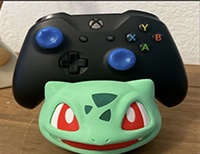
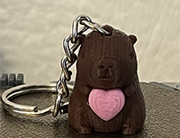
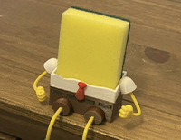
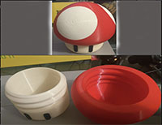

## Hi there 👋

<!DOCTYPE html>
<html lang="es">
<head>
    <meta charset="UTF-8">
    <meta name="viewport" content="width=device-width, initial-scale=1.0">
    <link rel="preconnect" href="https://fonts.googleapis.com">
    <link rel="preconnect" href="https://fonts.gstatic.com" crossorigin>
    <link href="https://fonts.googleapis.com/css2?family=Roboto:ital,wght@0,100..900;1,100..900&display=swap" rel="stylesheet">
    
    <link rel="stylesheet" href="./css/estilos.css">
    <title>Pelado Impresiones</title>
</head>
<body>
    <!--Menu navegacion-->
    <nav>
        <ul>
                 <li><a href="#sobremi">Sobre mi</a></li>
                 <li><a href="#impresiones">Impresiones</a></li>
                 <li id="logo"></li>
                 <li><a href="#contactar">Contactar</a></li>
        </ul>

    </nav>
    <article>
        <!--Bloque Inicio-->
                <section id="inicio">
                    <h2 class="titulo">PELADO IMPRESIONES</h2>
                    <h2 class="hastag">#Diseñador</h2>
                    <h2 class="hastag">#Programador</h2>

                    <ul id="redes_sociales">

                    <li><a href="https://www.tiktok.com/@peladoimpresiones" target="_blank"><i class="fa-brands fa-tiktok"></i></a></li>
                    <li><a href="https://www.facebook.com/profile.php?id=61575361329473" target="_blank"><i class="fa-brands fa-facebook"></i></a></li>
                    <li><a href="https://www.instagram.com/peladoimpresiones/" target="_blank"><i class="fa-brands fa-square-instagram"></i></a></li>

                    </ul>
                               
                            
                </section>
                <!--Fin Bloque Inicio-->

                <!--Bloque Sobre Mi-->
                <section id="sobremi">
                    <h2>Sobre mi:</h2>
                    
                    <h3>Soy <strong> diseñador y programador</strong>  de escasa cabellera, adicto a videojuegos y  con un empredimiento de impresiones 3D </h3>
                    <h3>Me defino como una persona creativa y enamorado de lo que hago, donde mi maxima es <cite>"solo si lo intentas vas a poder lograrlo". </cite> </h3>
                </section> 

                <!--Fin Bloque Sobre Mi-->

                <!--Bloque Sobre Impresiones-->
                <section id="impresiones">
                <h2>Impresiones</h2>
                <h3>Algunas de las cosas que hacemos:</h3>
                

                    

                        
                        <h3>Porta Joystick</h3>
                        <h4>Bulbasour</h4>
                        

                        
Bulbasour por Joystick

                        
<button type="button">MAS INFO</button>

                    

                    

                        
                        <h3>llavero</h3>
                        <h4>Capibara</h4>
                        

                        
LLlavero Capibara

                        
<button type="button">MAS INFO</button>

                    

                    

                        
                        <h3>Porta Esponja</h3>
                        <h4>Bob esponaja</h4>
                        

                        
Bob sponja porta espoja

                        
<button type="button">MAS INFO</button>

                    

                    

                        
                        <h3>Caja</h3>
                        <h4>Hongo</h4>
                        

                        
Hongo de Mario con rosca para guardad lo que se te cante

                        
<button type="button">MAS INFO</button>

                    

                    

                        <iframe width="250" src="https://www.youtube.com/embed/Rw4uQECnnOI?si=dNl74rpLJRRQU90u" title="YouTube video player" frameborder="0" allow="accelerometer; autoplay; clipboard-write; encrypted-media; gyroscope; picture-in-picture; web-share" referrerpolicy="strict-origin-when-cross-origin" allowfullscreen></iframe>
                        <h3>Yotube</h3>
                        <h4>Apex leyends</h4>
                        

                        
Torne de Apex leyends con .Caida

                        
<button type="button">MAS INFO</button>

                    

                

            </section>
                <!--Fin Bloque Sobre Impresiones-->

                <!--Bloque Contactar-->
            <section id="contactar">
                <h2>Contacto</h2>
                <h3>Envíame tus dudas</h3>
                <form action="#">
                    

                        <label for="nombre">Nombre</label>
                        <input type="text" id="nombre" name="nombre" minlength="2" maxlength="64" size="32" required>
                    

                    

                        <label for="empresa">Empresa</label>
                        <input type="text" id="empresa" name="empresa" minlength="2" maxlength="128" size="32">
                    

                    

                        <label for="email">Email</label>
                        <input type="email" id="email" name="email" minlength="10" maxlength="128" size="32" required>
                    

                    

                        <label for="mensaje">Mensaje</label>
                        <textarea name="mensaje" id="mensaje" cols="33" rows="5"></textarea>
                    

                    

                        <input type="submit" name="boton" value="CONTACTAR">
                    

                </form>
            </section>
            <!--FIN Bloque Contactar-->
    </article>
    
        <!-- Footer -->
        <footer>
            <ul>
                <li class="logo_footer"></li>
                <li>Pelado Puentes todos los derechos reservados, doblado en Palmera Records</li>
            </ul>
        </footer>
</body>
</html>

